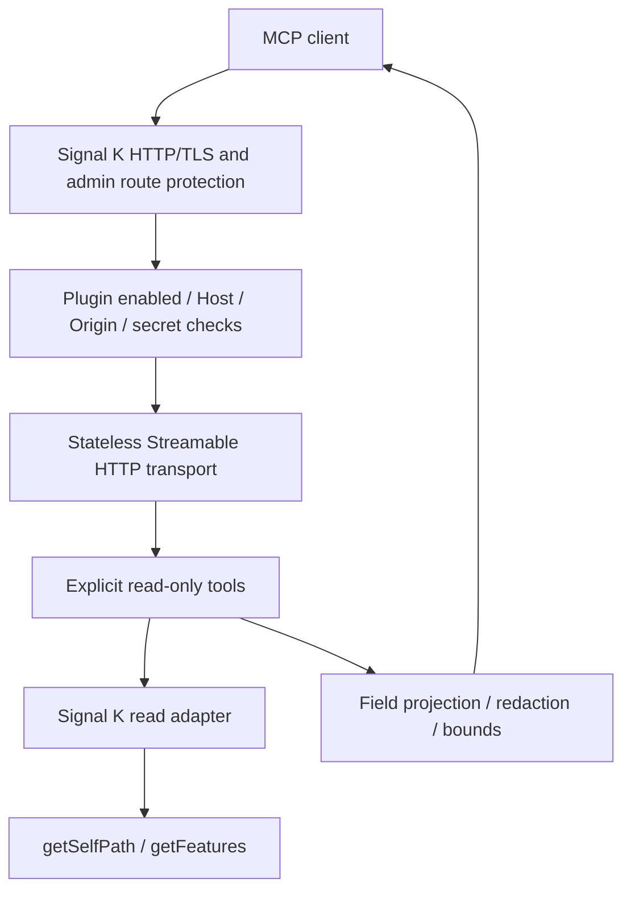

# Architecture

## Modules

`src/index.ts` owns the Signal K lifecycle, schema, route registration and transport disposal. It exports a CommonJS factory. Invalid configuration or a missing environment key leaves the route disabled. Stop first disables admission, then closes active transports. Existing router handlers refer to current state, so requests after stop receive 503; no private Express router structures are modified. Reconfiguration follows the host's stop/start lifecycle.

`src/tools.ts` defines the tool inventory, input schemas, response envelopes and generic error boundary. A fresh MCP server is connected for each POST, following the SDK's stateless approach; state is not shared between clients. This is appropriate for snapshot diagnostics, without notification streams or resumable sessions.

`src/adapter.ts` is the only component that reads the Signal K data model. Its narrowed `ReadAPI` type exposes just `getSelfPath` and `getFeatures`. It projects inventory fields and traverses only allowed telemetry roots. It does not receive a caller-controlled URL, file path, executable or method name. Config/log adapters intentionally do not exist yet.

`src/safety.ts` holds validation, prefix checks, constant-length hashed secret comparison and bounded safe copying. Redaction is defense in depth. It is not a substitute for field allowlists or an authorization boundary.

## Decisions

- Run inside Signal K to reuse its lifecycle, network listener and official data access. No additional service, hostname, certificate or port is assumed.
- Keep the default admin-only plugin route and add a separate environment-held key. A custom header avoids consuming Signal K's Authorization header. Per-user/path permissions are not propagated through this key; access is operator-level within configured prefixes.
- Use named tools for discoverability and small, bounded responses. No code execution tool is exposed.
- Prefer supported APIs. Server-internal functions need isolated, versioned adapters and an explicit unsupported state. Published API types do not establish runtime compatibility by themselves.
- Return native units, timestamps and unknown values honestly. Do not infer system health from absence of data.

## Compatibility and release work

Compiled against `@signalk/server-api` 2.33.0 and MCP SDK 1.30.1. The official FeatureInfo API is asynchronous and returns a plugin array. Unexpected shapes yield `UNSUPPORTED`. Tests use fixtures matching those types, plus an actual SDK client over HTTP.

No live Signal K server was used to establish a supported release range. Before declaring production support, pin a server version and verify plugin loading, process environment, admin-token enforcement, pre-parsed JSON, route behavior across disable/re-enable, TLS/proxy headers and client interoperability. Record those versions/results in the release notes. Add internal adapters only with tests derived from that exact server source and a documented upgrade strategy.

In-process execution shares Signal K's event loop. Result and traversal bounds constrain work but cannot interrupt a slow host API call. Use a deployment rate limiter if exposing the endpoint beyond a trusted network. There is no background polling, persistence or added stream subscription.
